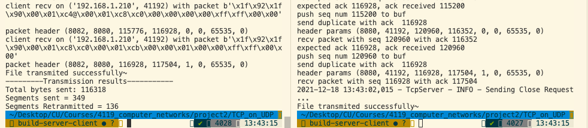

# TCP on top of UDP

## A Python version realization
In this project, I implement sending and receiving transport-level code for implementing a simplified version of TCP, which
conducted on top of UDP. 

And for this project, I used `checksum`, computed over the TCP header and data (with the 
checksum set to zero); this does not quite correspond to the correct way of doing it (which includes parts of the IP header), 
but is close enough. Also, imported `ACK number` and `sequence number` , `timer` to handle packets loss cases.

**More details of design can be found in [System Design](Design.md)**

## project structure
```
📦 src
 ┣ 📂 app
 ┃ ┣ 📂 data
 ┃ ┃ ┣ 📜 receivefile.txt
 ┃ ┃ ┣ 📜 recv_log.txt
 ┃ ┃ ┣ 📜 send_log.txt
 ┃ ┃ ┗ 📜 sendfile.txt
 ┃ ┣ 📂 error
 ┃ ┃ ┣ 📂 __pycache__
 ┃ ┃ ┃ ┣ 📜 __init__.cpython-38.pyc
 ┃ ┃ ┃ ┗ 📜 error.cpython-38.pyc
 ┃ ┃ ┣ 📜 __init__.py
 ┃ ┃ ┗ 📜 error.py
 ┃ ┣ 📂 helper
 ┃ ┃ ┣ 📂 __pycache__
 ┃ ┃ ┃ ┣ 📜 __init__.cpython-38.pyc
 ┃ ┃ ┃ ┗ 📜 helper.cpython-38.pyc
 ┃ ┃ ┣ 📜 __init__.py
 ┃ ┃ ┗ 📜 helper.py
 ┃ ┣ 📂 packets
 ┃ ┃ ┣ 📂 __pycache__
 ┃ ┃ ┃ ┣ 📜 __init__.cpython-38.pyc
 ┃ ┃ ┃ ┗ 📜 packet.cpython-38.pyc
 ┃ ┃ ┣ 📜 __init__.py
 ┃ ┃ ┗ 📜 packet.py
 ┃ ┣ 📂 utils
 ┃ ┃ ┣ 📂 __pycache__
 ┃ ┃ ┃ ┣ 📜 __init__.cpython-38.pyc
 ┃ ┃ ┃ ┗ 📜 utils.cpython-38.pyc
 ┃ ┃ ┣ 📜 __init__.py
 ┃ ┃ ┗ 📜 utils.py
 ┃ ┣ 📜 .DS_Store
 ┃ ┣ 📜 tcpclient.py
 ┃ ┗ 📜 tcpserver.py
 ┣ 📂 test
 ┗ 📜 .DS_Store
```
## screenshot


## Install and Run
- two ways of using this program
1. By terminal run python scripts
* **Note:  tested on macos platform**

First, open your project path, and input the operations in terminal
```bash
    $ cd your-project-path
```

And then start the tcpclient and tcpserver
```bash
    $ python3 src/app/tcpclient.py <sendfile.txt>  <send_ip> <send_port> <listening_port> <sendlog.txt> <window_size>
    $ python3 src/app/tcpserver.py <recvfile.txt> <listening_port> <recv_ip> <send_port> <recvlog.txt> 
```
Some explanations for args:
- tcpclient options arguments:
  - `listening_port`: The tcpclient receives acks from.
  - `send_port`:  The port send data to.
- tcpserver options arguments:
    - `listening_port`: The tcpclient receives data from.
    - `send_port`:  The port acks sent to.

start newudpl:
```bash
newudpl -i192.168.1.210:8080 -o192.168.1.210:8082 -L 50 -O 10 -B10
```

- example: test on my computer(macos)
    - start newudpl
    ```bash
        newudpl -i192.168.1.210:8080 -o192.168.1.210:8082 -B10 -L30 -O30 -d0.6
    ```
    - start tcpserver
    **Note that if your python alias is exactly python3+, then python would be fine as well**
    ```bash
        python3 src/app/tcpserver.py src/app/data/receivefile.txt 8082 192.168.1.210 8080 src/app/data/recv_log.txt 
    ```
    - start tcpclient
    ```bash
        python3 src/app/tcpclient.py src/app/data/sendfile.txt  192.168.1.210 41192 8080 src/app/data/send_log.txt 1152
    ```

2. run the `start-client.sh` and `start-server.sh` file, but please replace the `IP address` and `port` you want to run on before run the script.
    ```bash
    sh start-client.sh
    sh start-server.sh
    ```

## 


**Explaination**
- tcpclient<br/>
    class to send packet
- tcpserver<br/>
    class to receive packet
- error<br/>
    handle on invalid input of arguments
- helper<br/>
    extract some arguments from received packets
- utils<br/>
    handle on packet generate, extract and checksum calculation

## Potential Bugs

Cannot handle scenario of continious retransmission, for that `time out interval` would double continiously, which would result large timeout interval.

## Maintainer
- [Jing Peng](https://github.com/paterlisia)